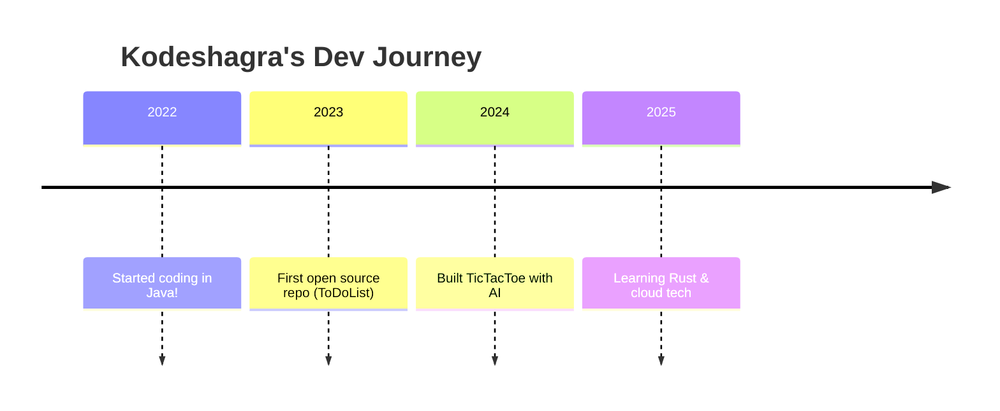

<!-- Profile README for kodeshagra/kodeshagra -->

  

  
  
  

---

## 🎨 About Me

Hi, I'm **Kodeshagra**—a creative coder, tech enthusiast, and experimenter.  
I turn ideas into code and love building things that are practical, fun, or just plain cool.

---

## 🚀 Tech Stack & Skills

  

- 🔹 **Languages:** Java, Python, JavaScript, HTML, CSS
- 🔹 **Tools:** Git, Markdown, Google Colab, AWS (basic)
- 🔹 **Other:** UI/UX, Automation, Game Dev, Cloud (learning), Open Source

---

## 📦 Featured Projects

<table>
  <tr>
    <td align="center">
      <a href="https://github.com/kodeshagra/ToDoList">
         
        <b>ToDoList</b>
      </a>
       
      <i>Minimalist, fast task tracker in Java</i>
    </td>
    <td align="center">
      <a href="https://github.com/kodeshagra/TicTacToe">
         
        <b>TicTacToe</b>
      </a>
       
      <i>Classic XO game, AI-powered, Python</i>
    </td>
    <td align="center">
      <a href="https://github.com/kodeshagra/JavaSingletonPractice">
         
        <b>JavaSingletonPractice</b>
      </a>
       
      <i>Design patterns, Java lab</i>
    </td>
  </tr>
  <tr>
    <td align="center">
      <a href="https://github.com/kodeshagra/hydrogen-template">
         
        <b>hydrogen-template</b>
      </a>
       
      <i>Modern project starter kit</i>
    </td>
    <td align="center">
      <a href="https://github.com/kodeshagra/Git">
         
        <b>Git</b>
      </a>
       
      <i>My Git experiments & notes</i>
    </td>
    <td align="center">
      
    </td>
  </tr>
</table>

---

## 📊 GitHub Stats & Activity

  
  

  

---

## 🛠️ Fun Facts & Journey

- 💡 I believe in “learning by building (and breaking) stuff.”
- 🧩 I love automating the boring things.
- 🎲 My favorite algorithm: **Dijkstra’s**!
- 🤖 My first game was **TicTacToe** with AI.
- 🌱 Always learning: currently exploring **Rust** and cloud-native dev.

---

## 🚦 Coding Timeline

---

## 🌐 Connect with Me

  
  
  <!-- Add more links: Email, Discord, etc., if you want -->

---

<b>“Stay curious. Stay creative. Code on!” 🚀</b>

